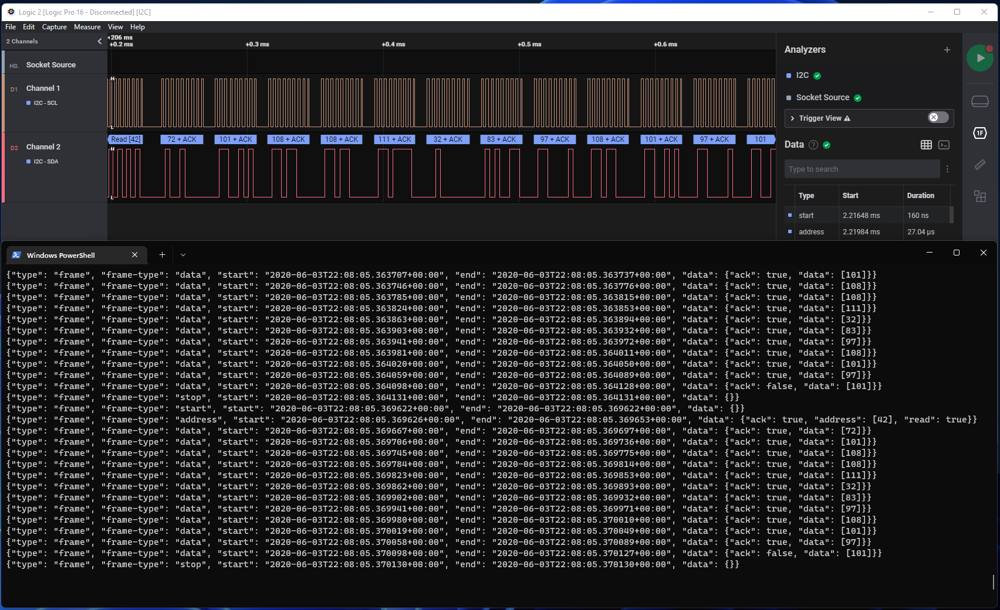
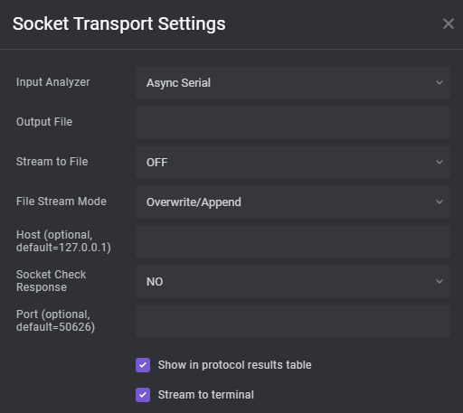

# SaleaeSocketTransportHLA Usage

A High Level Analyzer for Saleae which redirects analyzer frames to a network socket and accepts input on 
the same socket in order to generate AnalyzerFrames. Optionally supports sending data to a file either in-lieu of
a socket or in addition to a socket.



## Analyzer Options

The analyzer supports various user controlled options to allow for custom behavior. These options are 
shown in the screenshot below and can be generally divided into "Socket Controls" and "File Stream Controls".



Some general use cases:
- **You want to stream to a network socket only**: Set `Host|Port|Socket Check Response` as required for your client, set `Stream to File = OFF`.
- **You want to stream to a file only**: Set `Stream to File = ON, no socket`, and ensure that `Output File` is a valid path and full file name (with extension), set `File Stream Mode` as desired.
- **You want to stream to a socket and a file**: Follow the same general guidelines as the above options, but set `Stream to File = ON, with socket`.

### Socket Controls

| Option | Description |
| ------ | ----------- |
| Host   | Set the host address to bind the socket to. By default this will use `localhost` loopback on address `127.0.0.1`, but you can change this to a different network address provided that it can be routed to in the clear. |
| Port   | Set the port number to bind the socket to. By default this will use `50626`, but you can use any socket number you wish. A widely compatible range of 'ephemeral ports' would be in the range of `49125-65535`, anything in this range should be broadly safe to use. |
| Socket Check Response | Controls whether the analyzer should check for a response from the client. If there is no connection this setting doesn't matter and the analyzer won't check anyways, but **if there is a connection and the client does not respond the analyzer will wait indefintely**. |

### File Stream Controls

| Option | Description |
| ------ | ----------- |
| Stream to File   | Controls whether file streaming should be enabled or not, there are three options. `OFF` disables file streaming, and makes the other File Stream options irrelevant. `ON, with socket` enables streaming to a file and a socket at the same time. `ON, no socket` enables streaming to a file, and will not connect to a socket. |
| Output File   | Full and valid path to a file, including file name and extension. The final name of the output file will depend on the `File Stream Mode` selection. |
| File Stream Mode | Controls how data is saved to the file across multiple runs. `Overwrite/Append` should probably just be called `Append`, it will create the file exactly as named by `Output File`, multiple runs will continue appending data to this same file. `Sequence` will use the provided `Output File` to generate a monotonically increasing set of file names of the format `<fname>-<seq_num><ext>` where `Output File = <fname><ext>`, each analyzer run will create a new file. `Timestamp` will create a file name based on `Output File` of the format `<fname>-<timestamp><ext>` where the timestamp is of format `YYYY-MM-DDTHH-mm-ss`, each analyzer run will create a new file (assuming runs are separated by at least one second). |

## Socket Data Transport Format

This section details the transport formats for data going out of Saleae as well as what is expected to come back from the client. In both directions the data is transported as JSON encoded to a string with a newline character appended and then all encoded to bytes as UTF-8 data. The remainder of this section will describe the data structure using JSON notation and conventions.

### Data from socketserver to socketclient (Out of Saleae)

All data transmitted from socketserver is guaranteed to include at least one top level key `type` which contains string data indicating the type of the message being sent. There are three types of messages supported, detailed below.

#### `type=frame`

`frame` message types are the core message for data analysis. These message types are intended to be direct JSON compatible representations of the information available in each `AnalyzerFrame` as the HLA executes `decode`. See `AnalyzerFrame` in the [Saleae HLA API Documentation](https://support.saleae.com/extensions/api-documentation).

Each low-level analyzer has its own way of structuring data and it would be impossible to provide a comprehensive list here, so I will only detail the common keys and give a few examples.

Here is the schema for a `frame` message:

```json
{
  "type": "frame",
  "frame-type": "string",
  "start": "string",
  "end": "string",
  "data": "object"
}
```

| Key | Values Description |
| --- | ------------------ |
| type | String. Always `"frame"`. |
| frame-type | String. String content is analyzer dependent. |
| start | String. A string representation of the `SaleaeTime` object available on each `AnalyzerFrame`. This represents the start time of the frame data in the format of `YYYY-MM-DDTHH:mm:(s with decimal)Z`. This is a nanosecond precision timestamp. |
| end | String. The same thing as `start` but denotes the end of the frame instead. |
| data | Object. This will always be a JSON object type, though the contents of the object are entirely up to the low-level analyzer we are attached to. |

Between different low-level analyzers you can expect variation in `frame-type` and `data` and these differences can be used to act on the data in various ways. Saleae provides no direct way to know which low-level analyzer the HLA is connected to, so unfortunately there is not a more direct method to resolve this.

As the structure of `frame` messages can vary so widely depending on the low-level analyzer, it is not feasible to detail all of them here. Instead I will provide some examples, and if your use case falls outside of these examples then it would be best to use `socketclient.py` to print the messages being received from Saleae for the analyzer of your choice in order to understand the data structure.

The Saleae documentation for HLA AnalyzerFrame formats is a comprehensive guide to the types of data you can expect to receive from the built-in Analyzers. You can find [this documetation on the Saleae website](https://support.saleae.com/extensions/analyzer-frame-types).

[Async Serial decoder data](https://support.saleae.com/extensions/analyzer-frame-types/serial-analyzer) is one of the simplest analyzer formats, here is an example frame:

```json
{
  "type": "frame",
  "frame-type": "data",
  "start": "2022-04-30T04:53:34.454575584000Z",
  "end": "2022-04-30T04:53:34.454577166000Z",
  "data": {
    "data": [3]
  }
}
```

[I2C decoder data](https://support.saleae.com/extensions/analyzer-frame-types/i2c-analyzer) is more complex, offering several different frame-types and data structures, here are a few frames from a single transaction:

```json
{"type": "frame", "frame-type": "start", "start": "2020-06-03T22:08:05.369622480000Z", "end": "2020-06-03T22:08:05.369622640000Z", "data": {}}
{"type": "frame", "frame-type": "address", "start": "2020-06-03T22:08:05.369625840000Z", "end": "2020-06-03T22:08:05.369652880000Z", "data": {"ack": true, "address": [42], "read": true}}
{"type": "frame", "frame-type": "data", "start": "2020-06-03T22:08:05.369666800000Z", "end": "2020-06-03T22:08:05.369697360000Z", "data": {"ack": true, "data": [72]}}
{"type": "frame", "frame-type": "data", "start": "2020-06-03T22:08:05.369706320000Z", "end": "2020-06-03T22:08:05.369736400000Z", "data": {"ack": true, "data": [101]}}
{"type": "frame", "frame-type": "data", "start": "2020-06-03T22:08:05.369745360000Z", "end": "2020-06-03T22:08:05.369775280000Z", "data": {"ack": true, "data": [108]}}
{"type": "frame", "frame-type": "data", "start": "2020-06-03T22:08:05.369784400000Z", "end": "2020-06-03T22:08:05.369814320000Z", "data": {"ack": true, "data": [108]}}
{"type": "frame", "frame-type": "data", "start": "2020-06-03T22:08:05.369823440000Z", "end": "2020-06-03T22:08:05.369852880000Z", "data": {"ack": true, "data": [111]}}
{"type": "frame", "frame-type": "data", "start": "2020-06-03T22:08:05.369861840000Z", "end": "2020-06-03T22:08:05.369892880000Z", "data": {"ack": true, "data": [32]}}
{"type": "frame", "frame-type": "data", "start": "2020-06-03T22:08:05.369901840000Z", "end": "2020-06-03T22:08:05.369931760000Z", "data": {"ack": true, "data": [83]}}
{"type": "frame", "frame-type": "data", "start": "2020-06-03T22:08:05.369940880000Z", "end": "2020-06-03T22:08:05.369971280000Z", "data": {"ack": true, "data": [97]}}
{"type": "frame", "frame-type": "data", "start": "2020-06-03T22:08:05.369980240000Z", "end": "2020-06-03T22:08:05.370010160000Z", "data": {"ack": true, "data": [108]}}
{"type": "frame", "frame-type": "data", "start": "2020-06-03T22:08:05.370019280000Z", "end": "2020-06-03T22:08:05.370049200000Z", "data": {"ack": true, "data": [101]}}
{"type": "frame", "frame-type": "data", "start": "2020-06-03T22:08:05.370058320000Z", "end": "2020-06-03T22:08:05.370088560000Z", "data": {"ack": true, "data": [97]}}
{"type": "frame", "frame-type": "data", "start": "2020-06-03T22:08:05.370097680000Z", "end": "2020-06-03T22:08:05.370127280000Z", "data": {"ack": false, "data": [101]}}
{"type": "frame", "frame-type": "stop", "start": "2020-06-03T22:08:05.370130160000Z", "end": "2020-06-03T22:08:05.370130320000Z", "data": {}}
```

#### `type=client-notification`

`client-notification` message types are messages sent from the Saleae analyzer that are intended to be displayed to the end user of the client. 

| Key | Values Description |
| --- | ------------------ |
| type | String. Always `"client-notification"`. |
| data | String. Contains message to be displayed to client user. |
| level | String. One of `["warning", "info", "debug"]` listed in decreasing order of importance. Generally all `warning` messages should be communicated to the user, `info` messages are generally useful but not critical, and `debug` messages can safely be ignored. |

An example of a `client-notification` message follows:

```json
{
  "type": "client-notification",
  "data": "Connected to socket",
  "level": "info"
}
```

#### `type=client-control`

`client-control` message types are messages sent from the Saleae analyzer to the client with the intent of changing client 
settings or otherwise affecting client behavior. Each type of `client-control` message has a unique structure with the presence
of certain keys being the primary indicator of the control type.

Currently there is only one `client-control` message with the following schema:

```json
{
  "type": "client-control",
  "server-expects-response": "bool"
}
```

This message should be consumed by the client to control whether it responds to server messages or merely consumes them.

### Data from socketclient to socketserver (In to Saleae)

> NOTE: This implementation is still a work in progress and the documentation is expected to expand as new incoming data formats are implemented.
## Using socketclient.py

This repository includes a helper utility `socketclient.py` which can be used to connect to the Analyzer
socket, process received data, and generate responses back to the Analyzer. The behavior of this utility
is fully customizable by implementing your own subclass of `responsehandler.ResponseHandler`, there are a few
example implementations in that module to get started with.

You can exit this tool at any time with the `CTRL+C` key combination.

Basic usage instructions can be found with `python socketclient.py --help`:

```
usage: socketsink.py: Read data from a streaming socket and print to STDOUT [-h] [-H HOST] [-P PORT] [-q] [-r RESPONDER] [--quiet-receive] [--quiet-response] [--show-message-dir]

options:
  -h, --help            show this help message and exit
  -H HOST, --host HOST  host address to bind to
  -P PORT, --port PORT  port to bind to
  -q, --quiet           do not print any message responses
  -r RESPONDER, --responder RESPONDER
                        custom responder to process messages from server, provide a full path and class name as <fpath>:<class_name>
  --quiet-receive       do not print the data received from the server
  --quiet-response      do not print the data sent back to the server
  --show-message-dir    when logging responses, show direction of message transmission
```

### Example Response Handler and Usage of Custom Responder

Implementing a response handler is simple (in theory), as an example this section will walk through the 
steps necessary to implement a response handler that responds to every frame with the word "fish".

First, create a new file named `fishresponder.py` anywhere you like. The untracked `responders` folder
is provided in this repository for this purpose, but anywhere on your system should be fine.

Within that file, implement the following `ResponseHandler`:

```python
from responsehandler import ResponseHandler


class FishResponder(ResponseHandler):
    """A response handler that responds to every frame with the word 'fish'"""
    def handle_incoming_response(self, recv: str):
        decode = self.prepare_json_incoming(recv)

        # if the received data is not a frame, just send it back as we recieved it
        if decode['type'] != 'frame':
            return self.prepare_json_outgoing(recv)

        decode['frame-type'] = 'text'
        decode['data']['text'] = 'fish'
        return self.prepare_json_outgoing(decode)
  ```

 Now execute `socketclient.py` and tell it where to find your responder using the `-r/--responder` option, 
 if you placed the file in the `responders` folder, your executed command should look something like this:

 ```
 python socketclient.py -r responders/fishresponder.py:FishResponder
 ```

Finally, open up Saleae Logic 2 and attach the Socket Transport analyzer to a low level analyzer of your choice,
capture some data or analyze an existing file and watch as your data is transformed to fish.


## Using `socketserver` and `socketclient` Over the Network

While this HLA was designed primarily with the intent of routing data from within Saleae to another
data consumer on the same machine (using localhost loopback), the decision to use sockets as the underlying 
transport means we get the ability to send Saleae data to a remote machine for free. Again, this solution
is not necessarily robust, so YMMV.
